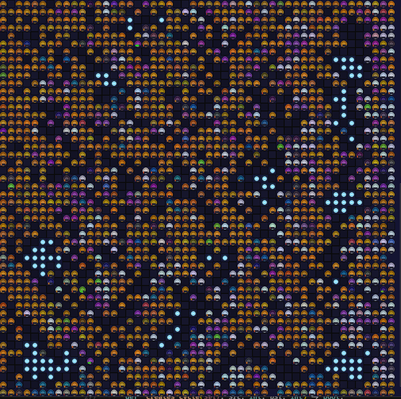
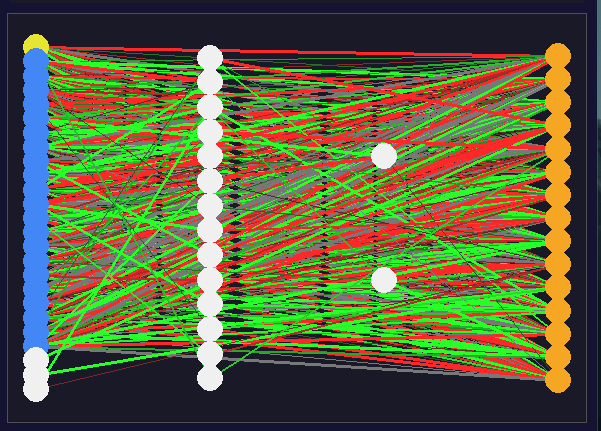
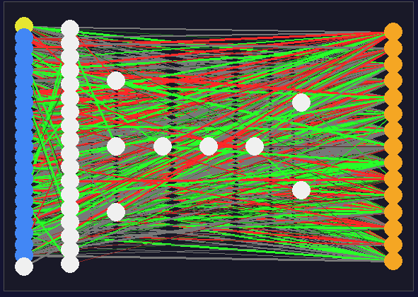
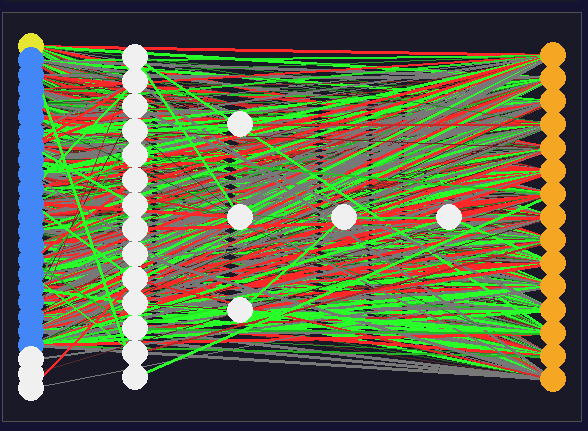
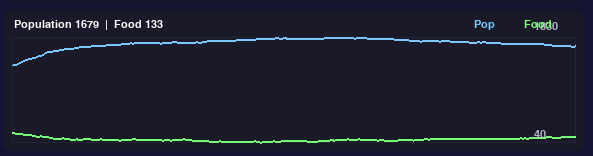

## Grid-Based Evolution Simulation (NEAT/Genetic Algorithms)

A Python project exploring evolutionary algorithms in a grid-based environment. The system uses genetic techniques (including NEAT-like neural evolution) to evolve agents over generations.

### Features
- **Grid environment** with agents interacting over discrete time steps
- **Neural networks** and **genetic operators** for evolving behavior
- **Logging** of population metrics over time (`population_log.csv`)
- **NEAT brain visualization** with proper rendering of recurrent cycles

### Project Structure
- `main.py`: Entry point to run a simulation
- `Environment.py`: Grid world dynamics and simulation loop helpers
- `GeneticModels.py`: Genetic algorithm logic and evolution utilities
- `NEAT.py`: NEAT-style structures and evolution of neural networks
- `nNet.py`, `Neurons.py`: Neural network building blocks
- `population_log.csv`: Example/run log of population metrics

### Requirements
- Python 3.9+ recommended
- Standard library only or minimal third-party deps (if any). If you use extra packages, install them via `pip install <package>`.

### Run
```bash
python main.py
```

If you use a virtual environment:
```bash
python -m venv .venv
.venv\\Scripts\\activate
python main.py
```

While running:
- Click on the grid to select an agent and view its brain in the right-side panel.
- The brain renderer supports recurrent connections (cycles); connection color encodes weight sign and thickness encodes magnitude.

### Configuration
- Adjust parameters inside `main.py`, `Environment.py`, or genetic/NEAT modules as needed.
- Tune population sizes, mutation rates, and environment settings to experiment.

### Images (Screenshots & Diagrams)
Place images in an `images/` folder at the project root and reference them from here. Examples:




#### Agent Brains (Diverse Examples)

Place multiple brain diagrams in `images/brains/` and reference them here:

- 
- 
- 

<details>
<summary>Generation Performance</summary>



</details>

Simulation Run:


Recommended image naming:
- `grid_overview.png`: A high-level screenshot of the grid and agents
- `brains/brain_dense.png`, `brains/brain_recurrent.png`, `brains/brain_sparse.png`: Visualizations of diverse agent neural networks
- `fitness_over_time.png`: Plot of fitness or population metrics over generations
- `simulation_run.png`: A screenshot of the simulation in action

Tip: If you generate plots during runs, save them into `images/` so the README links work.

### Notes
- Logs: Check `population_log.csv` for run metrics. You can visualize this with your favorite plotting tool and save figures under `images/`.
- Reproducibility: Consider fixing random seeds in your entry script when comparing runs.


